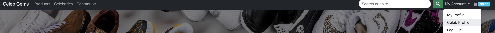

# Celeb Gems

**Deployed website: [Link to website](https://celeb-gems-99c19655d59c.herokuapp.com/)**

**Card number for payment testing: 4242424242424242**

## About

Celeb Gems is a cutting-edge e-commerce platform that facilitates direct sales between celebrities and their fans. Our platform serves as a bridge, allowing fans to purchase authentic items directly from their favorite celebrities. Whether you're a fan looking for exclusive merchandise or a celebrity eager to monetize your personal brand, CelebMarket offers a seamless marketplace for both buyers and sellers.

---

## UX

### Target Audience

1. Fans of Celebrities: CelebMarket caters to fans who are enthusiastic about connecting with their favorite celebrities on a deeper level. Whether you're a dedicated follower looking to own a piece of your favorite celebrity's wardrobe or a collector seeking exclusive memorabilia, CelebMarket provides a unique shopping experience tailored to your interests.

2. Celebrities and Influencers: CelebMarket also offers a platform for celebrities and influencers interested in monetizing their personal brand and engaging with their fan base. By joining CelebMarket, celebrities can create dedicated profiles to showcase their personal items for sale, share stories, and connect with fans globally. Whether you're a musician, actor, athlete, social media influencer, or public figure, CelebMarket provides a convenient and secure platform to leverage your influence and generate revenue by selling directly to your fans.

### User Stories

## User (Shopper)

| Issue ID                                               | User Story                                                                                                                                                                                                   |
| ------------------------------------------------------ | ------------------------------------------------------------------------------------------------------------------------------------------------------------------------------------------------------------ |
| [#1](https://github.com/yousefalm1/CelebGems/issues/1) | As a Shopper I can create a user account so that buy stuff and keep track of my past orders.                                                                                                                 |
| [#2](https://github.com/yousefalm1/CelebGems/issues/2) | As a shopper I want to easily navigate and search for products from my favorite celebrities, so that So that I can discover and explore a wide range of exclusive items by the celebrities I admire.         |
| [#3](https://github.com/yousefalm1/CelebGems/issues/9) | As a shopper I want to to explore featured celebrities and their profiles, so that So that I can learn more about the celebrities associated with the platform and discover new products they have to offer. |
| [#4](https://github.com/yousefalm1/CelebGems/issues/7) | As a shopper I want to easily add products to my shopping cart and proceed to a secure checkout process so that I can seamlessly complete my purchase and receive my chosen items.                           |
| [#5](https://github.com/yousefalm1/CelebGems/issues/6) | As a shopper I want to I want to be able to send a form to Celeb Gems, so that So that I can have them answer any questions i may have.                                                                      |
| [#6](https://github.com/yousefalm1/CelebGems/issues/4) | As a shopper I want to I want to view detailed product pages with high-quality images, descriptions, and prices, so that So that I can make informed decisions and understand the uniqueness of each item.   |

## Admin

| Issue ID                                                 | User Story                                                                                                                                                                                    |
| -------------------------------------------------------- | --------------------------------------------------------------------------------------------------------------------------------------------------------------------------------------------- |
| [#1](https://github.com/yousefalm1/CelebGems/issues/14)  | As a administrator I want to review and approve celebrity applications so that we can ensure the authenticity of celebrities on the platform and maintain a high-quality shopping experience. |
| [#2](https://github.com/yousefalm1/CelebGems/issues/14)  | As a administrator I want to add, edit, or remove products and content as needed, so that I have the ability to manage and update the platform's offerings efficiently.                       |
| [#3](https://github.com/yousefalm1/CelebGems/issues/192) | As a administrator I want to be able to view and manage user accounts, so that I can ensure the security and integrity of the platform.                                                       |
| [#4](https://github.com/yousefalm1/CelebGems/issues/193) | As a administrator I want to be able to look at all the contact us forms user has sent so that we can look at them and either answer the questions or deal with the message that was sent.    |
| [#5](https://github.com/yousefalm1/CelebGems/issues/194) | As a administrator I want to access and review all orders placed so that I can monitor sales activity and ensure efficient order processing.                                                  |

## As a Celebrity

| Issue ID                                                 | User Story                                                                                                                                                             |
| -------------------------------------------------------- | ---------------------------------------------------------------------------------------------------------------------------------------------------------------------- |
| [#1](https://github.com/yousefalm1/CelebGems/issues/12)  | As a Celebrity I want to show the products i added on my profile so that users can find all the products i offer on my profile instead of Searching.                   |
| [#2](https://github.com/yousefalm1/CelebGems/issues/10)  | As a celebrity I want to manage and update my personal information on my Celeb Gems profile so that fans can stay informed about me.                                   |
| [#3](https://github.com/yousefalm1/CelebGems/issues/11)  | As a celebrity I want to add products the website so that fans can buy the stuff i add.                                                                                |
| [#4](https://github.com/yousefalm1/CelebGems/issues/195) | As a Celebrity I want to edit the products i added so that I can update any missing product details or improve the product details to improve the sales of the product |

## Business Model

The Business model for this is Commission-Based Model Celeb Gems would earn revenue by taking a commission on each transaction made on the platform. This commission could be a percentage of the total sale price of items sold by celebrities. For example, celeb Gems could would take a 10% commission on each sale made through the platform. This model incentivizes Celeb Gems to facilitate sales and drive revenue for celebrities while providing a convenient platform for fans to purchase merchandise.

---

## Technologies used

- ### Languages:

  - [Python 3.9.5](https://www.python.org/downloads/release/python-395/): The language used to develop the backend side of the website.
  - [JS](https://www.javascript.com/): The language used to create the interactive parts of the website.
  - [HTML](https://developer.mozilla.org/en-US/docs/Web/HTML): the mark up language used to make the website.
  - [CSS](https://developer.mozilla.org/en-US/docs/Web/css): the styling language used to style the website.

- ### Frameworks and libraries:

  - [Django](https://www.djangoproject.com/): Python-based framework, serves as the backbone for implementing all the logic of the website.
  - [jQuery](https://jquery.com/): jQuery is employed to manage click events and AJAX requests.

- ### Databases:

  - [PostgreSQL](https://www.postgresql.org/): PostgreSQL was used as the database to store all data.
  - [SQLite](https://www.sqlite.org/): was used as i developed the website then used PostgreSQL.

- ### Other tools:

  - [Git](https://git-scm.com/): Git was
    the chosen version control system for managing the codebase.
  - [Pip3](https://pypi.org/project/pip/): Pip3 is utilized as the package manager for installing the project dependencies.
  - [Gunicorn](https://gunicorn.org/): Gunicorn is employed as the web server to host and serve the website.
  - [Psycopg2](https://www.psycopg.org/): Psycopg2 serves as the database driver responsible for establishing connections to the database.
  - [Django-allauth](https://django-allauth.readthedocs.io/en/latest/): Django-allauth is the chosen authentication library utilized to create and manage user accounts.
  - [Django-crispy-forms](https://django-cryptography.readthedocs.io/en/latest/): Django-crispy-forms is utilized to control the rendering behavior of Django forms, enhancing the user interface and experience.
  - [GitHub](https://github.com/): GitHub serves as the platform for hosting the website's source code repository and providing version control
  - [VSCode](https://code.visualstudio.com/): the IDE used for creating this website.
  - [Stripe](https://stripe.com/): used to create the payment system for the website.
  - [Pillow](https://pypi.org/project/pillow/): Pillow is a Python Imaging Library (PIL) for handling image file formats,

---

# Features

## Access to pages according to the user role:

| Page Name                    | Logged out | Customers | Celebs | Admin |
| ---------------------------- | ---------- | --------- | ------ | ----- |
| Home                         | Yes        | Yes       | Yes    | Yes   |
| login                        | Yes        | Yes       | Yes    | Yes   |
| Register                     | Yes        | Yes       | Yes    | Yes   |
| Store Products               | Yes        | Yes       | Yes    | Yes   |
| Store Products Details       | Yes        | Yes       | Yes    | Yes   |
| Celebs                       | Yes        | Yes       | Yes    | Yes   |
| celebs details               | Yes        | Yes       | Yes    | Yes   |
| My profile                   | No         | Yes       | Yes    | Yes   |
| Request Celeb Profile        | No         | Yes       | No     | Yes   |
| Celeb Profile                | No         | No        | Yes    | Yes   |
| Create Celeb Profile         | No         | No        | Yes    | Yes   |
| Edit Celeb Profile           | No         | No        | Yes    | Yes   |
| Add Product To Celeb Profile | No         | No        | Yes    | Yes   |
| Contact Us                   | Yes        | Yes       | Yes    | Yes   |
| Bag                          | Yes        | Yes       | Yes    | Yes   |
| Contact Us                   | Yes        | Yes       | Yes    | Yes   |

# Main features

## NavBar

### NavBar (Not Logged In )

- If user is not logged in they will only be able to see products, celebs, contact us, log in and register

### NavBar (Logged In )

- If user creates an account and logs in they will be able to see products, celebs, contact us, my profile, request celeb profile, log out.

- If the user wants to request a celeb profile they will have the option if there are logged in.

### Navbar (Celeb Profile)

- If celeb profile got approved they will have access to the celeb profile link which will redirect them to there celeb profile.

## Footer

- The footer is basic it included the company, back to top link, privacy and terms link.

- The footer is the same on all pages.

## Home Page

1. Carousel/Hero Section:

   - This prominent feature of the home page consists of three rotating images, each with a distinct call-to-action:
     - Products: The first image showcases featured products, allowing users to click the "Products" button and seamlessly navigate to the products page.
     - Celebs: The second image highlights popular celebrities, inviting users to explore all celebrities by clicking the "All Celebs" button and accessing the dedicated celebs page.
     - Contact Us: The third image provides a direct link to the contact us page, enabling users to easily reach out for assistance or inquiries.

2. Popular Celeb Section:

   - Users are greeted with a curated selection of the three most popular celebrities on the platform.
   - Admins have the exclusive capability to handpick these featured celebrities from the admin panel.
   - The admin panel offers a straightforward interface where admins can toggle a button to include a celebrity on the home screen.
   - Only three profiles can be selected for display on the home screen to maintain clarity and focus. Any attempt to select more will trigger an error message.
   - Users can discover more about each celebrity through a brief bio and have the option to navigate to the celeb's profile details page with a single click.

3. Latest Products Section:
   - Users can stay up-to-date with the newest additions to the platform by exploring the latest products section.
   - Admins have the authority to hand-select three products to feature prominently on the home page.
   - Similar to the popular celeb section, admins can manage these featured products via the admin panel, ensuring control and precision in showcasing new offerings.
   - The selection of products for the home screen is exclusive to admin privileges, maintaining consistency and quality in the displayed content.
